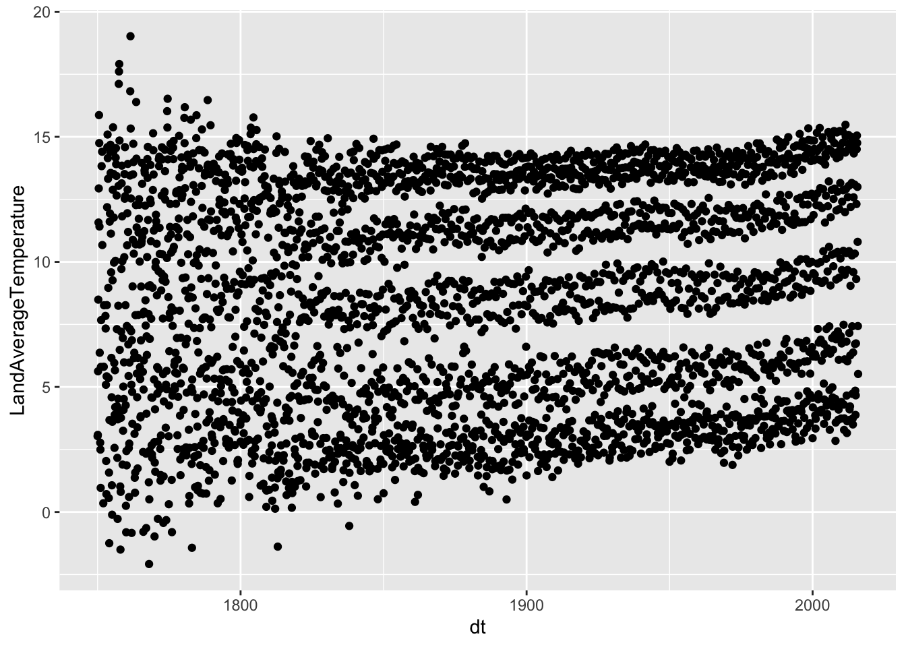
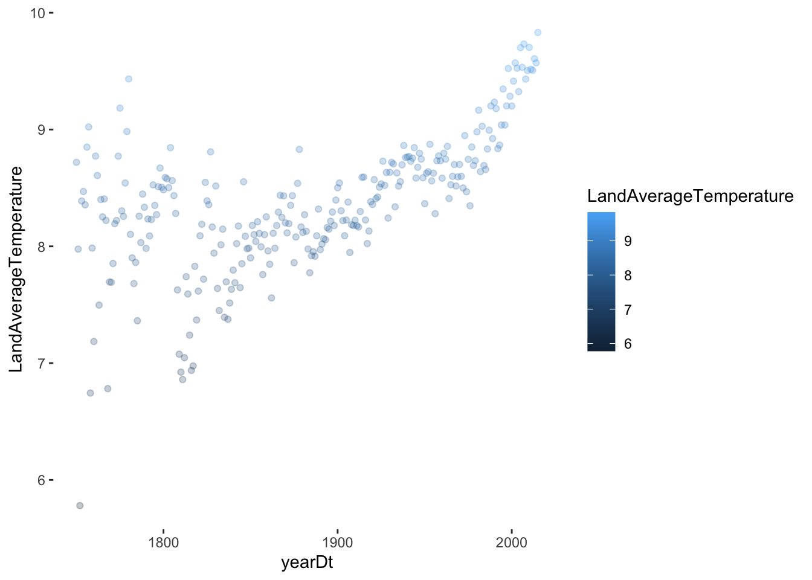
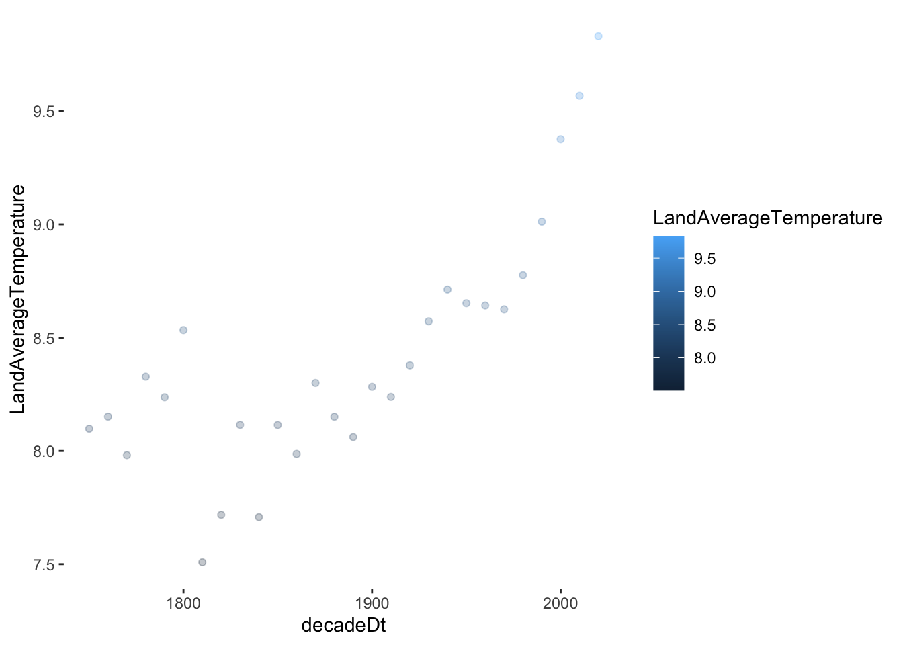

This was a project done for a Data Science Concepts course as part of our Masters program in Data Science at Constructor University Bremen. It analyzes global temperature changes using deviations from a baseline and determines the relationship between GDP and temperature deviation via a linear model. It shows that temperatures have increased globally throughout the years with a sharper increase in the last 50 years. The relationship between global temperatures and GDP is not entirely clear.

## Data set

Berkeley Earth put together the data set, which compiles three of the most cited land and ocean temperature data sets: NOAA’s MLOST, NASA’s GISTEMP, and the UK’s HadCrut. It combines **1.6 billion temperature reports from 16 pre-existing archives**, including Global Land and Ocean-and-Land Temperatures (GlobalTemperatures.csv), which tracks the **average land and ocean temperatures from 1750** along with their uncertainties and their maximums and minimums (from 1850) until 2015. Additionally, it contains sheets that slice the data by country, state, and city.

The global_temp dataframe contains 3192 observations of 9 variables. The dates range from 1750-01-01 to 2015-12-01. So (2015-1750)\*12+12 = 3192 dates (for every month). **We have one unique record for every month**

## **How have temperatures risen across the world since 1750?**

There is a visible increase in the years from 1900 to 2000 and beyond, with 4-5 “bands” that most likely indicate seasons. The data from 1750 to 1850 has a bit more of noise/uncertainty. This “noise” may be the result of unstandardized data collection and multiple sources.

{width="451"}

This displays the entire dataset with temperatures for every month, which fluctuate due to season in every location. We can smooth it out by breaking it down by year and decade or comparing months across the years.

{width="502"}

There is a clear rise in the average temperature over the last two centuries and a steep rise in the last 10-20 years. This proves our hypothesis somewhat that the sharpest increase has occurred within the last 50 years.

The decade distribution shows the same increase:

{width="501"}

## **Quantifying the rise**

It is clear that global temperatures have risen and will likely continue to do so. We want to explore precisely how much they have been increasing. For this, we need a metric to identify how far the LandAverageTemperature has deviated from a baseline that makes sense.

Climate science is a constantly evolving field; different models use different baselines. The baseline period is chosen depending on the specific research question addressed, the availability of data for that time, and the ability of the model to accurately simulate climate conditions over that period.

Some studies use the first 100 years of available data as a baseline. While other more recent climate models, such as paleoclimate ones, use pre-Industrial Revolution years as a baseline. This accounts for the significant effects of industrialization on climate.

We selected the average of the previous 100 years (1750 to 1850) as an initial baseline to compare how the average temperatures have risen since 1850.

::: row
```         
<div class="col-sm mt-3 mt-md-0">
    
</div>
<div class="col-sm mt-3 mt-md-0">
    
</div>
<div class="col-sm mt-3 mt-md-0">
    
</div>
```
:::

::: caption
```         
Caption photos easily. On the left, a road goes through a tunnel. Middle, leaves artistically fall in a hipster photoshoot. Right, in another hipster photoshoot, a lumberjack grasps a handful of pine needles.
```
:::

::: row
```         
<div class="col-sm mt-3 mt-md-0">
    
</div>
```
:::

::: caption
```         
This image can also have a caption. It's like magic.
```
:::

You can also put regular text between your rows of images. Say you wanted to write a little bit about your project before you posted the rest of the images. You describe how you toiled, sweated, *bled* for your project, and then... you reveal its glory in the next row of images.

::: {.row .justify-content-sm-center}
```         
<div class="col-sm-8 mt-3 mt-md-0">
    
</div>
<div class="col-sm-4 mt-3 mt-md-0">
    
</div>
```
:::

::: caption
```         
You can also have artistically styled 2/3 + 1/3 images, like these.
```
:::

The code is simple. Just wrap your images with `<div class="col-sm">` and place them inside `<div class="row">` (read more about the <a href="https://getbootstrap.com/docs/4.4/layout/grid/">Bootstrap Grid</a> system). To make images responsive, add `img-fluid` class to each; for rounded corners and shadows use `rounded` and `z-depth-1` classes. Here's the code for the last row of images above:



``` html
<div class="row justify-content-sm-center">
    <div class="col-sm-8 mt-3 mt-md-0">
        
    </div>
    <div class="col-sm-4 mt-3 mt-md-0">
        
    </div>
</div>
```

